## Who am I?

* teacher CPD tech lead
* previously worked on [School Experience](https://github.com/DFE-Digital/schools-experience), [Curriculum materials](https://github.com/DFE-Digital/curriculum-materials/) and [Get Into Teaching](https://github.com/DFE-Digital/get-into-teaching-app)
* built and maintain some gems

## What is CPD? 🦒

- **NPQ** stands for National Professional Qualifications
- **ECF** stands for the Early Careers Framework
- **CPD** stands for Continuing Professional Development
- **CPD = ECF + NPQ**

## What are NPQs?

NPQs are voluntary qualifications that teachers can apply to do to further
their career.

They might help a teacher progress to being a head of department, an
expert in a particular subject or in becoming a headteacher.

## What is ECF?

All new teachers are _Early Career Teachers_ for the first two
years of their induction. During this time they have access
to a mentor and a set of training materials.

## Overview

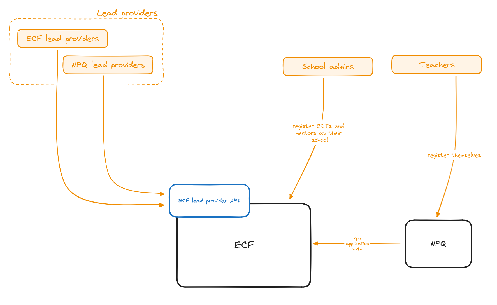

## Timeline

2020.
  - **November:** first commit to ECF repo
2021.
  - **March:**
    * induction tutor nomination beta
    * revised statutory guidance published
  - **April:** induction tutor nomination open for all schools
  - **July:**
    * registration opens for all schools
    * contracts with providers finalised
  - **September**:
    * peak registration
    * large helpdesk volumes
    * SLAs exceeded 🚨

--- 

2022.
  - **May:** registration opens for all schools
  - **July:** I joined CPD 😬
  - **September---October:**
    * peak registration
    * critical helpdesk volumes
    * peaks at 3,000 open tickets 🗻
    * people from other programmes needed to be drafted to help man Zendesk
    * SLAs exceeded 🚨

---

2023.
  - **January:**
    * helpdesk volumes fall to pre-registration levels
    * feature development stops, focus shifts to fixing the app ready for next registration
  - **June:** registration opens for all schools
  - **September---October:**
    * peak registration
    * extra helpdesk staff and overtime means most SLAs met

## Observations

* less than 8 months between the first commit and opening registration for all schools
* it took us nearly 4 months to recover after 2022's registration period and a further 6 to prepare for 2023's
* **there was no private beta** 😩
* our support queries in 2022 fell into two main categories:
  1. things which people wanted to but couldn't change via the user interface (numerous, shallow)
  2. data quality problems (few, deep)
* **we couldn't solve the deep problems while running the service**

# **The deeper problems**

# Ownership

---

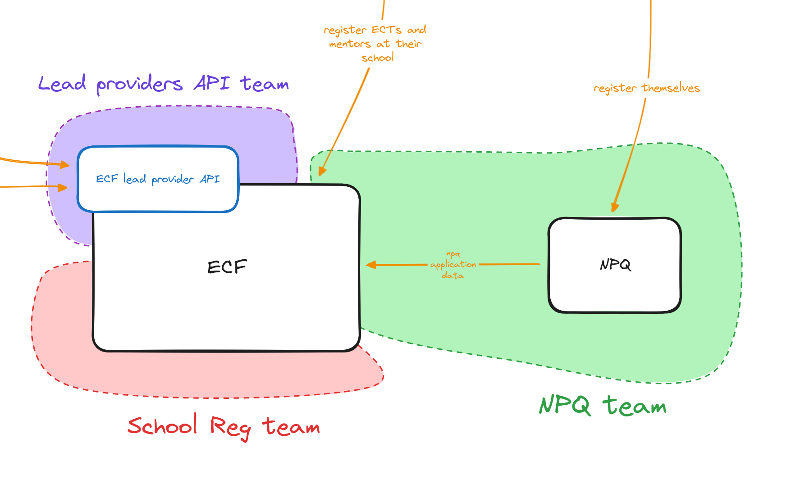

---

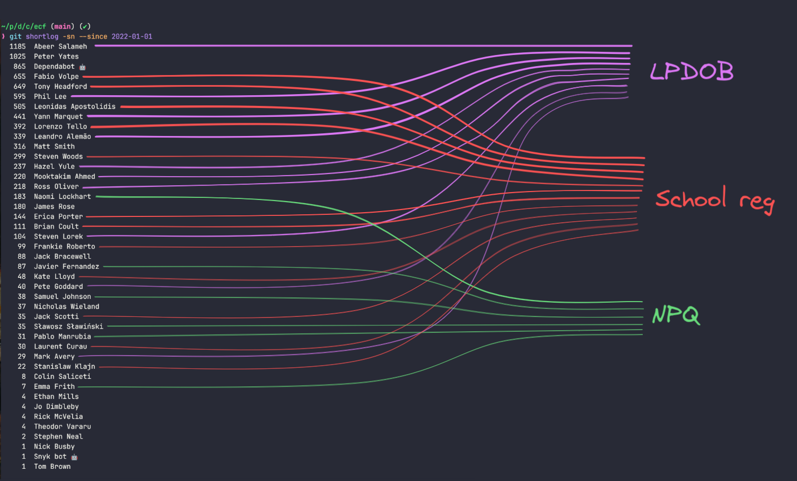{height=250}

---

We have:

* two policies
* three teams
* two repositories
* two databases
* one API

---

### Why is this bad?

* each team wants to solve its own problems
  - coordinating new features across teams takes extra effort
  - sometimes things developed in isolation overlap
  - when fields aren't intuitively named they're sometimes misunderstood by other teams and misused
* it introduces lots of questions like:
  - who is responsible for this data?
  - where should I report this bug?

---

* it makes releasing features that span teams/apps more complicated:
  - changes need to be planned far in advance
  - space needs to be found in every involved team's roadmap
  - new functionality needs to be feature flagged for coordinated releases
  - inter-app communication is hard to test in review apps

# The database

* tries to deal with two separate and very different policies
* doesn't do a great job of either
* **not well normalised** 💥
* a severe lack of validation leading to many data quality problems
* queries are often complex and inefficient
* uses single table inheritance 😞
* statuses are often calculated rather than stored

---

Finding the current induction record is **a real problem**.

---

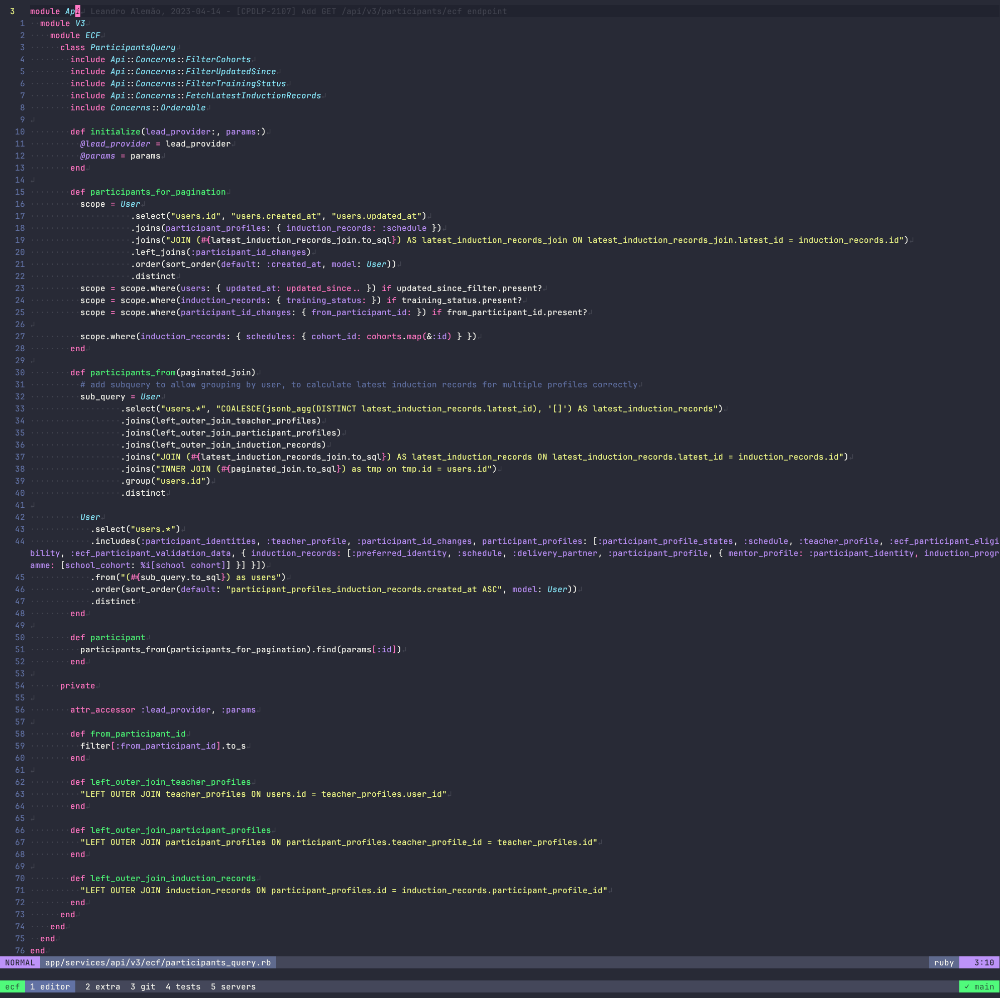{height=280}

---

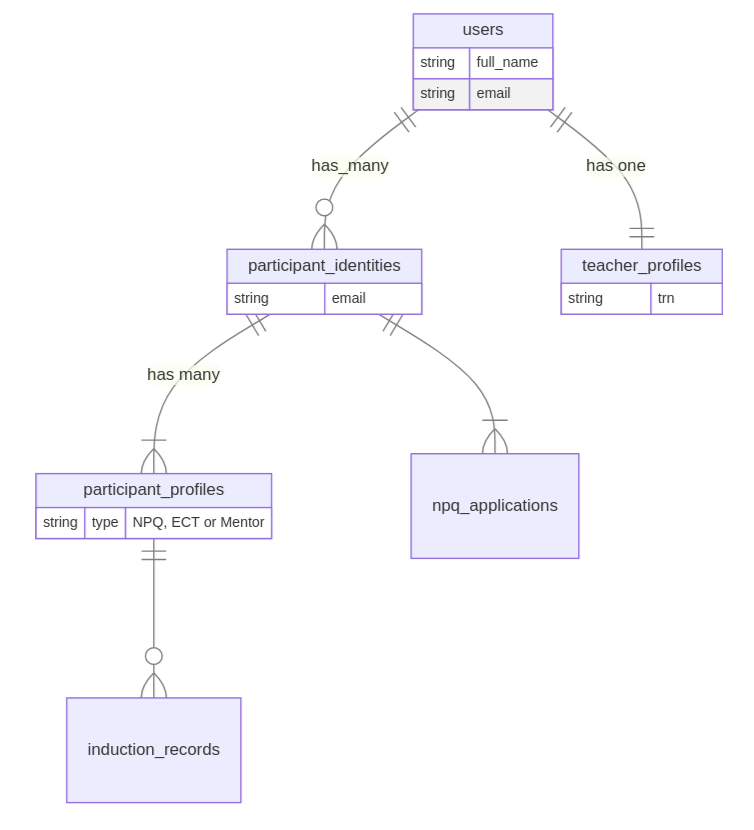{height=150}

---

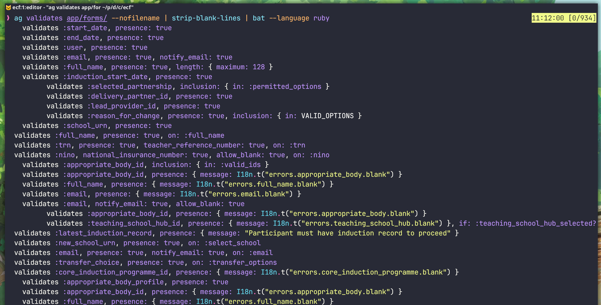{height=200}

---

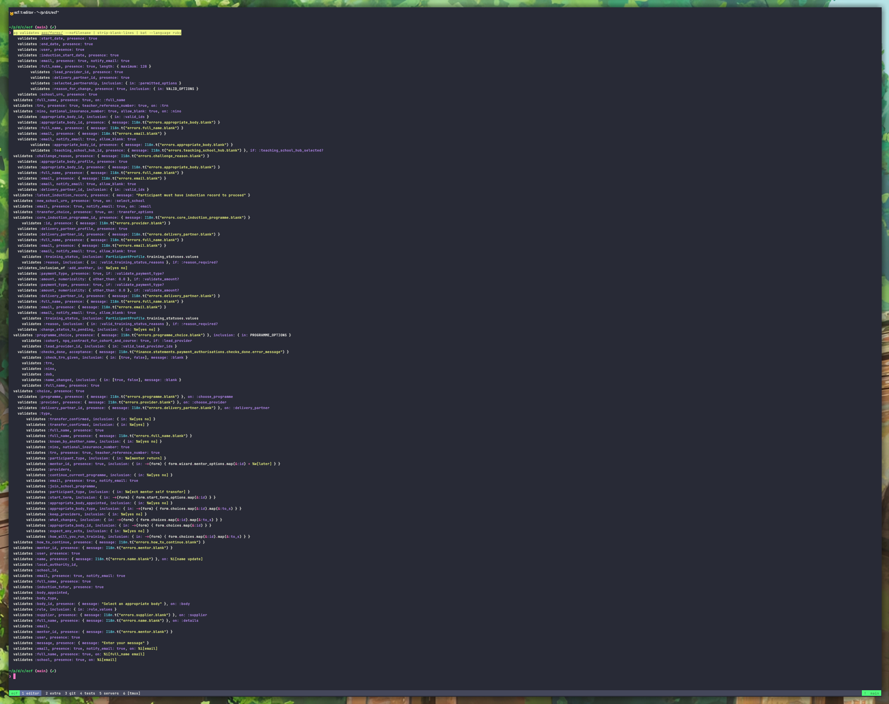{height=200}

---

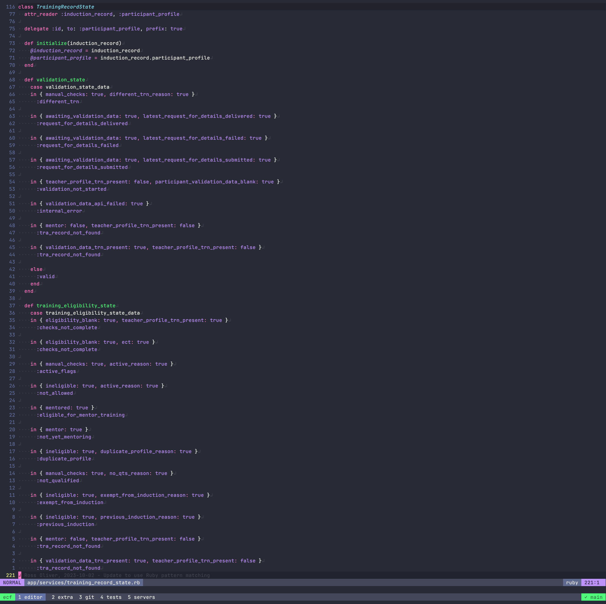{height=300}

# Relying on `rails console`

1. lack of validation and normalisation leads to data problems
2. we didn't have the infrastructure (service classes, admin pages) to make
   complex changes safe --- they often span several tables
3. mistakes were made, especially during the 2022 registration crisis --- we're still
   finding them
4. we have created service objects and admin pages that help us make complex
   changes safely
6. we haven't retrospectively added validation, too many things break

---

> Narrator: And CPD developers still manually fix data with the Rails console in production, every day.

> {height=150}

# **Solving the deeper problems**

# First, separating NPQ and ECF

---

## Separation solves the ownership problem

We're going to make NPQ a standalone service.

* two policies
* ~~three~~ two teams
* two repositories
* two databases
* ~~one~~ two APIs

---

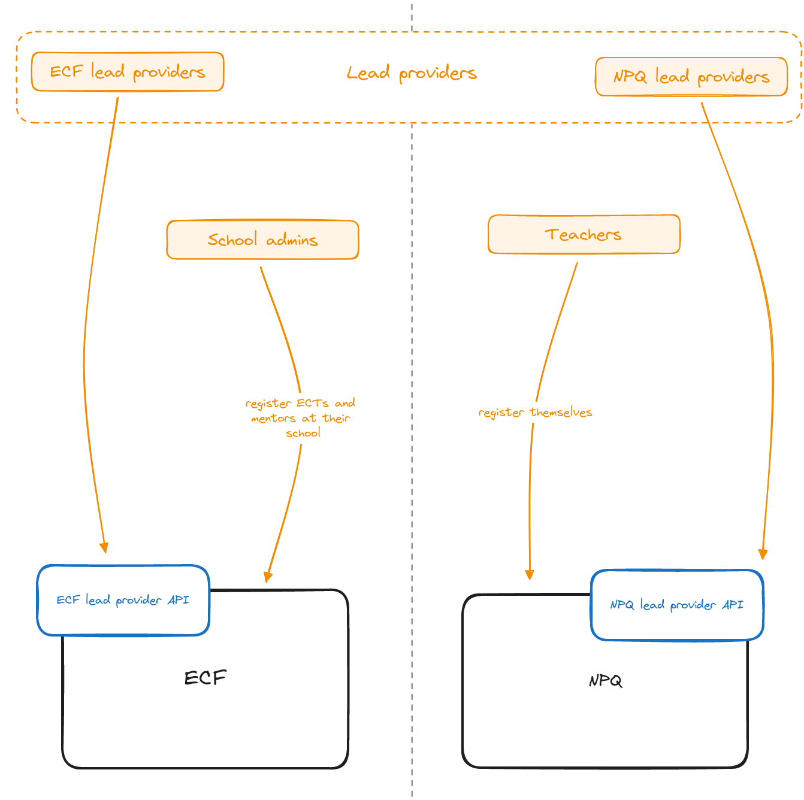{height=250}

---

## Data first

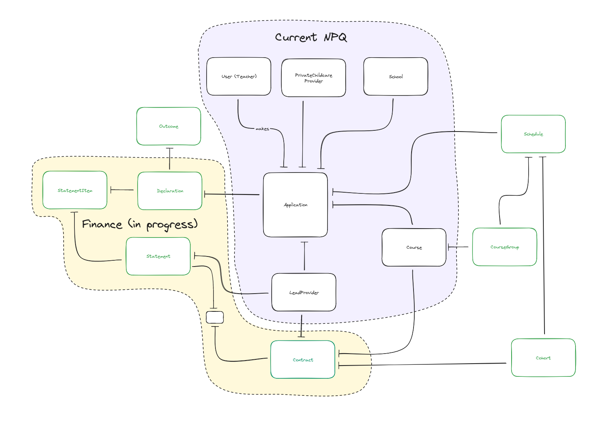{height=250}

---

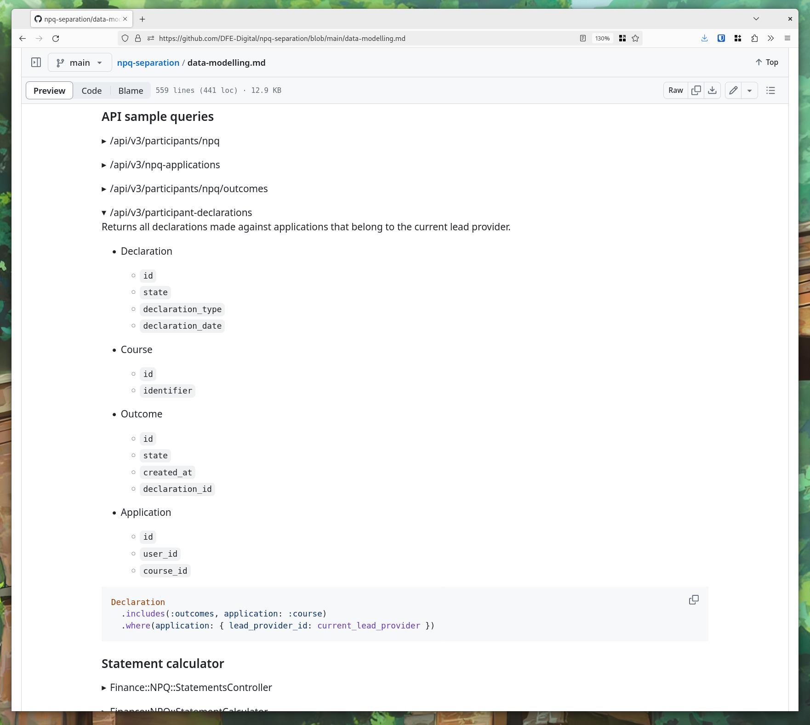{height=250}

---

## Improving things we do poorly in ECF

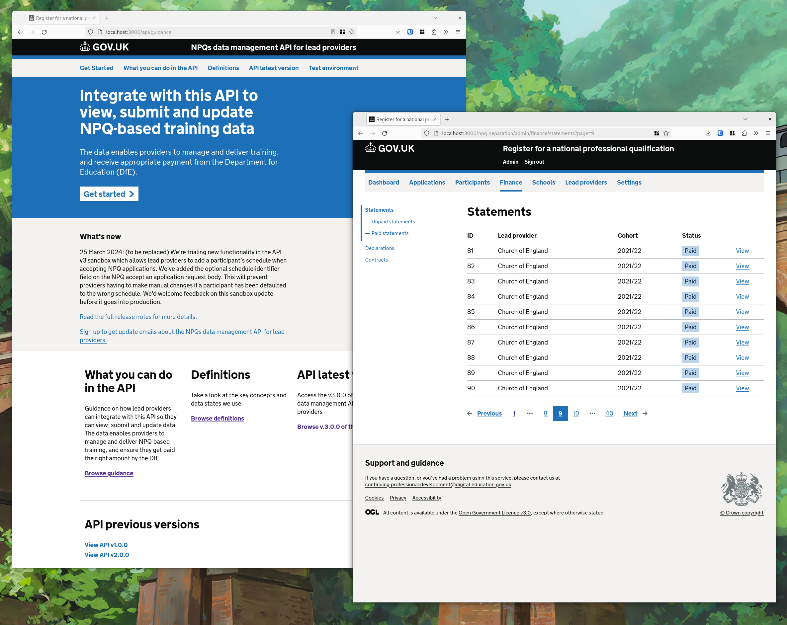{height=250}

# Second, rewriting ECF

## We're about to start

There isn't really much to show yet, but we're starting **very soon**.

## Approach

* Solve the most complicated data problems first
* Use what we learnt during the NPQ separation
* Early focus on building tooling we can share between ECF and NPQ, like:
  - multi-step forms
  - admin structure and navigation
  - GOV.UK-style Swagger documentation
